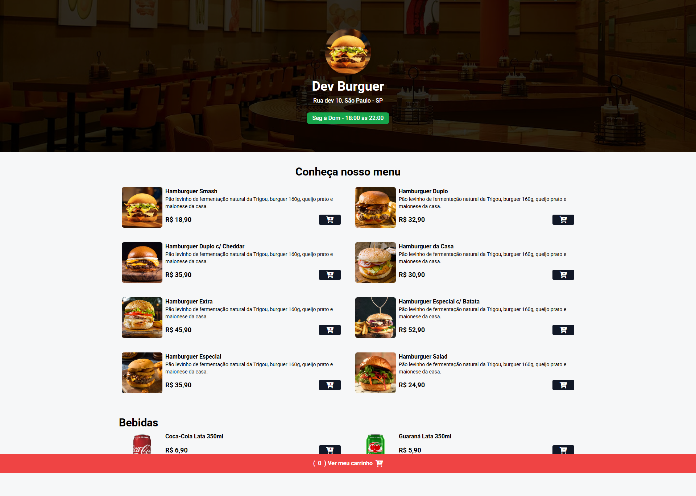

# Dev Burguer
 Landing Page responsiva para pedidos de uma hamburgueria, desenvolvida para estudo. O projeto permitiu adquirir novos conhecimentos e aprimorar habilidades em desenvolvimento web, responsividade e criação de interfaces modernas.

##  Tecnologias utilizadas

    
    
    

## 🛠️ Ferramentas

    
    

## 🌐 Deploy

Acesse o projeto online:

## 🖥️ Demonstração

